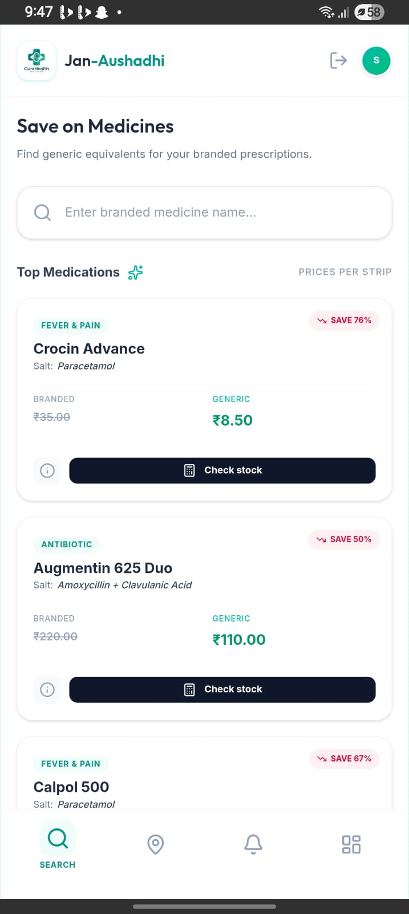
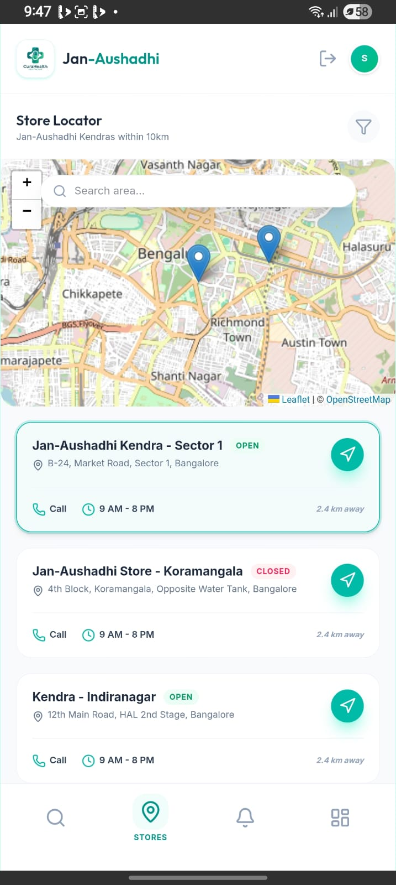
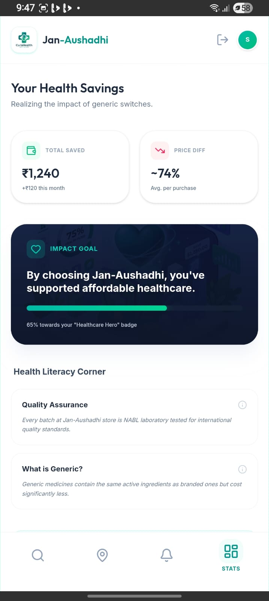

<div align="center">

</div>

---

# 💊 JanAushadhi Finder

A healthcare-based Android application developed to help users locate nearby **Jan Aushadhi Kendras** and search affordable generic medicines available under the **Pradhan Mantri Bhartiya Janaushadhi Pariyojana (PMBJP)** initiative.

The application aims to improve accessibility to low-cost medicines and provide users with quick information about medicine availability and center locations.

---

## 📱 Features

✅ Search nearby Jan Aushadhi centers  
✅ Medicine search functionality  
✅ View medicine details and availability  
✅ User-friendly Android interface  
✅ Healthcare support application  
✅ Easy navigation between modules  
✅ Real-time location assistance *(if enabled)*

---

## 🛠️ Technologies Used

- Android Studio
- Java / Kotlin *(Update according to your project)*
- XML
- Google Maps API
- Firebase *(if used)*
- Android SDK
- Gradle

---

## 📂 Project Structure

```bash
Janaushadhi-Finder/
│── app/
│── gradle/
│── assets/
│── res/
│── AndroidManifest.xml
│── build.gradle
│── README.md
```

---

## 🚀 Application Workflow

1. User opens application  
2. Search medicine name  
3. Application retrieves medicine details  
4. Locate nearby Jan Aushadhi centers  
5. Display center information and availability  
6. User navigates to selected center

---

## 🏥 Problem Statement

Many people struggle to find affordable medicines and nearby Jan Aushadhi centers. Existing methods require manual searching and consume time.

This project provides a digital solution to:

- Improve medicine accessibility
- Reduce search time
- Promote affordable healthcare
- Support PMBJP initiative

---

## 🎯 Objectives

- Help users locate Jan Aushadhi centers
- Provide medicine search capability
- Increase awareness of generic medicines
- Improve healthcare accessibility
- Create a simple and efficient mobile solution

---

## 📸 Screenshots

Add application screenshots here:

| Home Screen | Medicine Search | Center Locator |
|------------|----------------|----------------|
||||

---

## ⚙️ Installation

Clone repository:

```bash
git clone https://github.com/nabeelsyed11/Janaushadhi-Finder.git
```

Open project in Android Studio:

```bash
File → Open → Select Project Folder
```

Build project:

```bash
Gradle Sync → Run App
```

---

## 🔮 Future Enhancements

- Medicine availability tracking
- User login system
- Medicine recommendation engine
- GPS optimization
- Notification support
- Online appointment integration
- Healthcare analytics dashboard

---

## 👨‍💻 Developer

**Mr. Syed Nabeel Ahmed**

[![GitHub] (https://github.com/nabeelsyed11)]

---

## App installation 

## 📥 Download APK

[](https://github.com/nabeelsyed11/Janaushadhi-Finder/releases/download/v1.0/JanAushadhi-Finder.apk)

---


## 📄 License

This project is developed for educational and internship purposes.

MIT License
